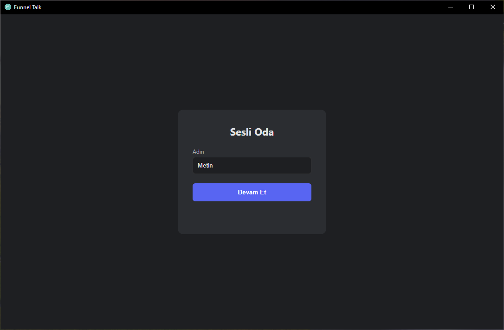
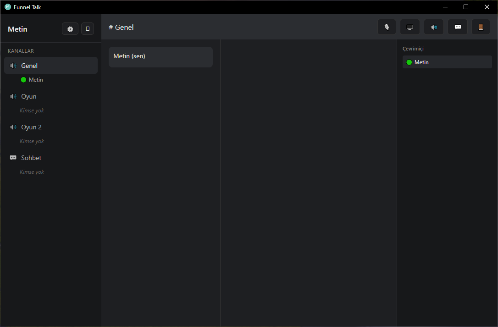
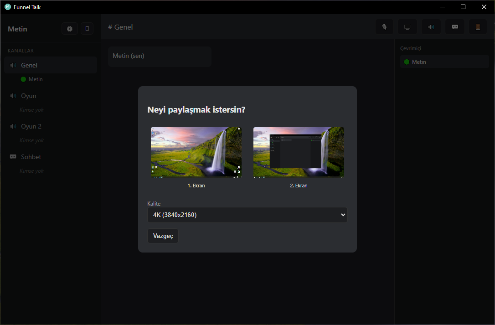

# 🎙️ Funnel Talk

**[🇹🇷 Türkçe](README.md) | [🇬🇧 English](README.en.md)**

A lightweight, self-hosted voice/video chat application for friend groups. Brings Discord's core features (voice channels, screen sharing, soundboard, text chat) to a small friend group on infrastructure you fully control.

## 🤔 Why This Project?

Due to access restrictions on Discord in Turkey, I created Funnel Talk to provide my friend group with a reliable communication and gaming environment. Existing voice chat applications each fell short in different ways and didn't fully meet our specific needs. By building a lightweight, fully-controlled alternative, we can stay connected securely while gaming and organizing social events all on a single platform.

<p align="center">
  
  
  
</p>


---

## ✨ Features

**Voice & Video Communication**
- Multiple voice channels, one-click join
- Live preview of who's in a channel before joining
- Screen sharing with quality selection (480p up to 4K, with FPS and bitrate control)
- Opt-in viewing — no one auto-watches a stream, saving bandwidth
- Broadcaster sees who is currently watching
- Fullscreen viewing support

**Audio Quality & Control**
- Per-person volume control (0–300%), independent and persistent for every user
- Volume preferences are tied to a device ID — they survive display-name changes
- Voice activation threshold — automatically gates out low-level background noise
- Limiter — smooths out sudden loud spikes (shouting, mic bumps)
- Noise suppression support
- Microphone/speaker device selection, master volume control

**Soundboard**
- Server-wide shared sound effects
- Playing a sound is only heard by your current channel
- Easy uploads (max 5 seconds, named/emoji-tagged)

**Text Chat & File Sharing**
- Real-time per-channel messaging; all messages persist on the server
- Dedicated text-only channel support
- File, photo, and video sharing (100MB limit per file)
- Shared media (photos/videos) display as previews within the chat
- Click on an image or video to open it in a modal window; close with the X button
- All files are downloadable via Save-As dialog
- When a message is deleted, its attached file is permanently removed from the server
- Message authors and admins can delete messages
- Previous messages in a channel auto-load when you switch channels

**Personalization**
- 4 themes (Dark, Light, Midnight Blue, Purple)
- Customizable global shortcuts (mute toggle, stop stream) — work even when the app isn't focused
- Google sign-in (optional)
- Session and all preferences persist across restarts

**Infrastructure**
- Auto-update via GitHub Releases
- Runs in the system tray in the background
- Duplicate-name prevention per channel
- Sound effects for join/leave, stream start/stop, and new-viewer notifications

---

## 🏗️ Architecture

```
┌───────────────────┐        ┌──────────────────┐        ┌───────────────────────┐
│  Electron Client  │◄──────►│   LiveKit Cloud  │◄──────►│    Electron Client    │
│    (Windows)      │ WebRTC │  (media server)  │ WebRTC │       (Windows)       │
└─────────┬─────────┘        └──────────────────┘        └───────────┬───────────┘
          │                                                          │
          │                 HTTPS (token request)                    │
          ▼                                                          ▼
     ┌────────────────────────────────────────────────────────────────────┐
     │               Token Server (Raspberry Pi + Tailscale Funnel)       │
     │   • Issues authentication tokens                                   │
     │   • Prevents duplicate names within a channel                      │
     │   • Hosts soundboard audio files                                   │
     └────────────────────────────────────────────────────────────────────┘
```

- **Client (Electron)** — the desktop app installed on each friend's computer. All audio processing (noise suppression, limiting, gating, volume mixing) happens client-side via the Web Audio API.
- **LiveKit Cloud** — the actual carrier of audio/video. A WebRTC-based SFU (Selective Forwarding Unit) that routes media.
- **Token Server** — a small Node.js/Express service running 24/7 on a Raspberry Pi. It only issues short-lived access tokens and hosts soundboard files; no audio/video ever passes through it.

---

## 🧱 Tech Stack

| Layer | Technology |
|---|---|
| Desktop app | Electron 31 |
| Real-time media | LiveKit (livekit-client / livekit-server-sdk) |
| Token server | Node.js, Express |
| Audio processing | Web Audio API (GainNode, DynamicsCompressor, AnalyserNode) |
| Packaging & distribution | electron-builder, electron-updater |
| Hosting | Raspberry Pi 5 + Tailscale Funnel |
| Authentication | Google OAuth 2.0 (optional) |

---

## 📦 Installation (For Users)

No development environment needed to join a friend group:

1. Download the latest `Funnel-Talk-Setup-X.X.X.exe` from the [Releases](https://github.com/metinncetinn/funnel-talk/releases/latest) page.
2. Double-click to install. If Windows SmartScreen shows a warning, click **"More info" → "Run anyway"** (expected, since the app is unsigned).
3. Open the app, enter your name (or sign in with Google), and click a channel.

Future updates are downloaded automatically in the background; no reinstallation needed.

---

## 🛠️ Setup (Self-Hosting)

This section is for anyone who wants to host their own token server so friends can connect to your instance. Setup takes ~20–30 minutes and requires no special technical knowledge.

### Prerequisites

- **Node.js 18+** — Download from [nodejs.org](https://nodejs.org/en)
- **A machine running 24/7**:
  - Old/spare desktop (Windows/Mac/Linux)
  - Raspberry Pi 4+ (recommended, low power ~€100)
  - VPS/cloud server (Hetzner, AWS EC2, ~€5–10/month)
- **GitHub account** (optional, for auto-updates)

### Quick Start (5 Minutes)

If you have a Raspberry Pi or Linux server:

1. Copy `server.js` to the server
2. Create `.env` file (see below)
3. Open terminal in the server folder:
   ```bash
   npm install express multer livekit-server-sdk dotenv
   node server.js
   ```
4. Open Tailscale Funnel: `tailscale funnel --bg 3001`
5. Copy the URL to `renderer/config.js`
6. Build Electron app: `npm run build`
7. Send the installer to friends

### Detailed Setup (Step-by-Step)

#### Step 1: Create a LiveKit Cloud Account

1. Visit [cloud.livekit.io](https://cloud.livekit.io)
2. Sign up with your email (free)
3. Go to **Keys** in the left menu
4. Save these 3 values:
   - **API Key**: `APxxxxxxxxxxxx`
   - **API Secret**: `xxxxxxxxxxxxxxxxxxxxxx`
   - **URL**: `wss://proj-xxxxx.livekit.cloud`

#### Step 2: Set Up the Token Server

Create a new folder on your computer, e.g., `funnel-talk-server`

Inside this folder, create these 3 files:

**File 1: `.env`**
```env
LIVEKIT_API_KEY=paste_your_API_KEY_from_step1
LIVEKIT_API_SECRET=paste_your_API_SECRET_from_step1
LIVEKIT_URL=paste_your_URL_from_step1
PORT=3001
HOST=0.0.0.0
ADMIN_USERS=admin
```

**File 2: `package.json`**
```json
{
  "name": "funnel-talk-server",
  "version": "1.0.0",
  "scripts": {
    "start": "node server.js"
  },
  "dependencies": {
    "express": "^4.18.2",
    "multer": "^1.4.5",
    "livekit-server-sdk": "^0.6.0",
    "dotenv": "^16.0.0"
  }
}
```

**File 3: `server.js`**

Copy the `server.js` file from this repository into this folder.

#### Step 3: Install Dependencies

Open a terminal:
```bash
cd funnel-talk-server  # enter the folder
npm install
```

#### Step 4: Test the Server

```bash
npm start
```

You should see:
```
Funnel Talk server 0.0.0.0:3001
```

Press `Ctrl+C` to stop.

#### Step 5: Expose to the Internet (Tailscale Funnel)

Sign up at [tailscale.com](https://tailscale.com), download and install the app.

In your terminal:
```bash
tailscale funnel --bg 3001
```

You'll see a URL like:
```
https://my-computer-name.tail123456.ts.net
```

**Save this URL** — your friends will use it.

#### Step 6: Configure the Electron App

Open `renderer/config.js`, update this line:

```js
TOKEN_SERVER_URL: 'https://my-computer-name.tail123456.ts.net',  // ← Your URL from Step 5
```

#### Step 7: Build and Share

In the project folder (not the server folder):
```bash
npm install
npm run build
```

Find `Funnel-Talk-Setup-X.X.X.exe` in the `dist/` folder. Send this to your friends — they can download, install, and use it.

#### Step 8: Run the Server Permanently (Optional)

So the server starts even if the computer restarts:

**Windows (Task Scheduler):**
1. Press `Win` → type "Task Scheduler" → open it
2. Right side → "Create Basic Task"
3. Give it a name (e.g., "Funnel Talk Server")
4. Trigger: "At startup"
5. Action: Program = `node.exe`, Arguments = `C:\path\to\server.js`
6. Click "Create"

**Raspberry Pi/Linux (systemd):**
```bash
sudo cp sesli-oda-token.service /etc/systemd/system/
sudo systemctl daemon-reload
sudo systemctl enable sesli-oda-token
sudo systemctl start sesli-oda-token
```

### 💡 Troubleshooting

| Problem | Solution |
|---|---|
| `PORT 3001 already in use` | Close the other app using port 3001, or change `PORT` in `.env` |
| Server runs but URL doesn't work | Make sure Tailscale is installed and you ran `tailscale funnel --bg 3001` |
| App won't start / token error | Double-check `config.js` has the correct URL |
| Friends can't connect | Verify the `.env` values are correct; restart the server if needed |

### 📋 Alternative Hosting

- **VPS (Hetzner, Linode)**: SSH in, install Node.js + server, runs 24/7
- **Docker**: Write a `Dockerfile`, run `docker run` (advanced)
- **AWS Lambda / Vercel**: Serverless hosting (easier but pricier)

---

## ⚙️ Configuration Reference

| File | Purpose |
|---|---|
| `renderer/config.js` | Token server address, channel list |
| `main.js` | Google OAuth credentials, window/tray behavior |
| `token-server/.env` | LiveKit credentials |
| `package.json` → `build` | App name, icon, publish (release) settings |

---

## ⌨️ Default Shortcuts

| Action | Default Shortcut |
|---|---|
| Toggle Microphone | `Ctrl+Shift+M` |
| Stop Screen Share | `Ctrl+Shift+S` |

Customizable from Settings → Shortcuts. These shortcuts work globally, even when the app isn't focused.

---

## 🔒 Security Notes

- The token server only issues short-lived (12-hour) LiveKit access tokens; raw API credentials are never sent to the client.
- The `.env` file and LiveKit credentials are not part of this repo — keep `token-server/` separate or excluded via `.gitignore`.
- Google OAuth runs in "testing" mode; only test users you explicitly add can sign in, which is a good fit for small groups without requiring app verification.

---

## 📋 Known Limitations

- Only one person's screen share is shown in the main viewing area at a time.
- Screen sharing can include system audio when the operating system and selected source allow it.
- Currently packaged for Windows only.

---

## 🗺️ Roadmap

Completed:
- [x] Voice channels, screen sharing and viewing
- [x] Soundboard audio panel
- [x] Per-channel text chat
- [x] Persistent chat history stored on server
- [x] Clickable URLs in chat messages
- [x] Chat file/photo/video attachments (100MB limit)
- [x] Image/video attachment modal preview
- [x] File download support
- [x] Admin/author message deletion (with file cleanup)
- [x] Token server + LiveKit access token generation
- [x] Load message history when switching channels

Planned features:
- [ ] Support for watching multiple simultaneous streams
- [ ] Shared music playback via YouTube/link bot
- [ ] macOS/Linux packaging support
- [ ] Message search and filtering

---

## 📄 License

This project was built as a private friend-group project.
